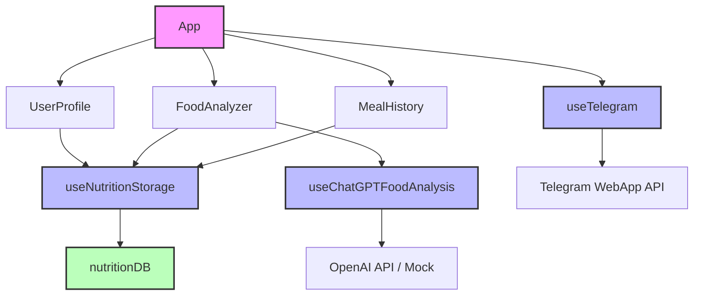
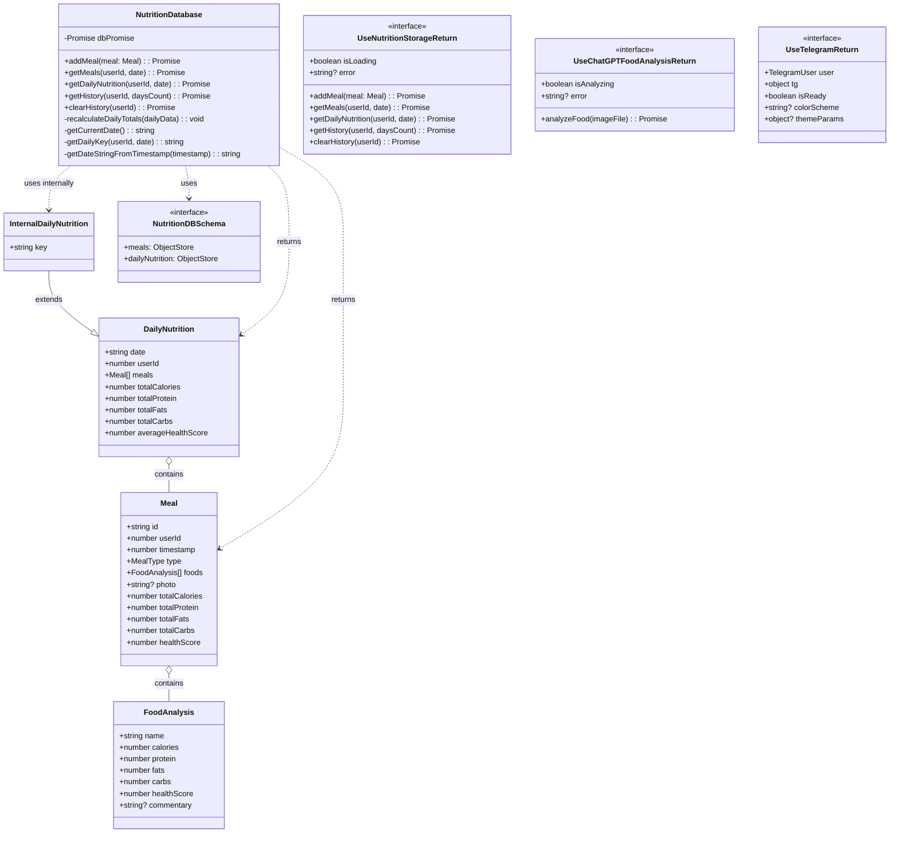
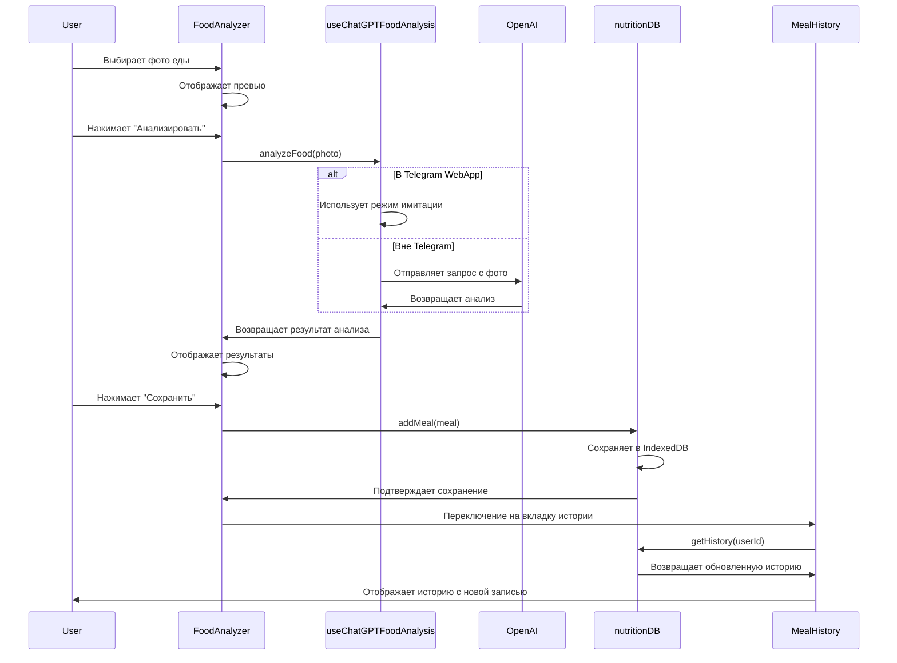
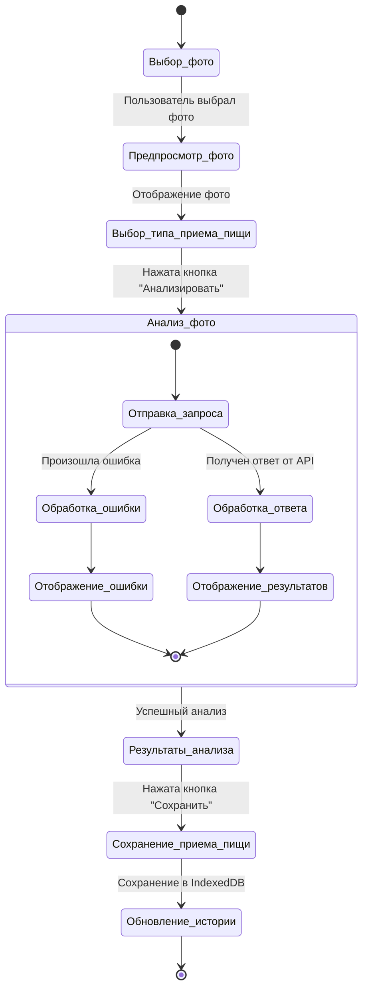
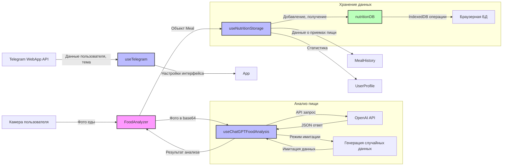
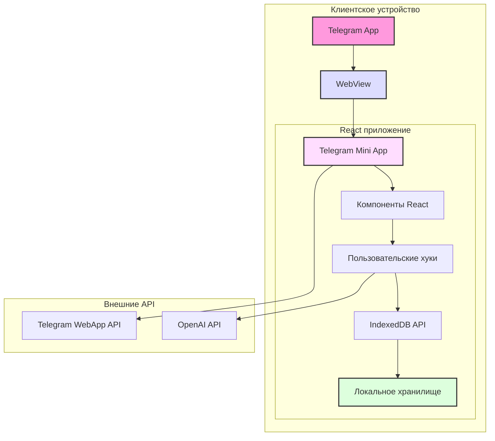
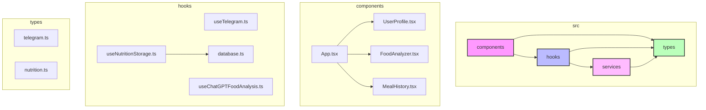
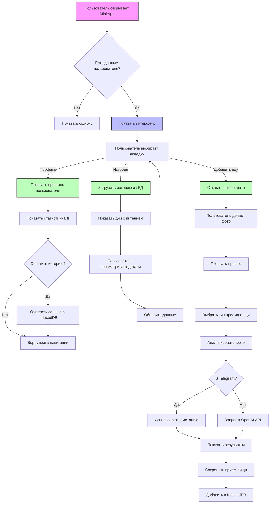
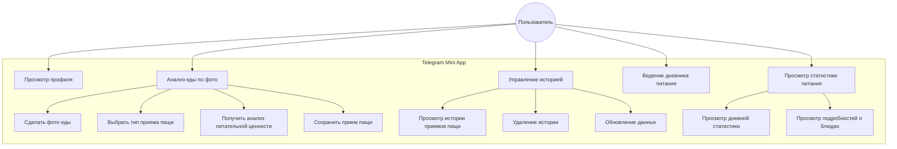

# UML-диаграммы проекта "Дневник питания"

В этом документе представлены UML-диаграммы, описывающие архитектуру и структуру проекта "Дневник питания".

## Диаграмма компонентов



## Диаграмма классов



## Диаграмма последовательности: Анализ фото еды



## Диаграмма состояний: Процесс анализа еды



## Диаграмма потока данных



## Диаграмма развертывания



## Диаграмма пакетов



## Диаграмма активности: Полный процесс использования приложения



## Диаграмма сущность-связь для базы данных

```mermaid
erDiagram
    USER ||--o{ DAILY_NUTRITION : has
    USER ||--o{ MEAL : creates
    DAILY_NUTRITION ||--o{ MEAL : contains
    MEAL ||--o{ FOOD_ANALYSIS : contains
    
    USER {
        number id PK
        string first_name
        string last_name
        string username
        boolean is_premium
        string language_code
    }
    
    DAILY_NUTRITION {
        string key PK
        string date
        number userId FK
        number totalCalories
        number totalProtein
        number totalFats
        number totalCarbs
        number averageHealthScore
    }
    
    MEAL {
        string id PK
        number userId FK
        number timestamp
        string type
        string photo
        number totalCalories
        number totalProtein
        number totalFats
        number totalCarbs
        number healthScore
        string dateString IDX
    }
    
    FOOD_ANALYSIS {
        string name
        number calories
        number protein
        number fats
        number carbs
        number healthScore
        string commentary
    }
```

## Диаграмма использования (Use Case)

